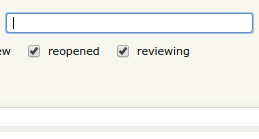

# Eyeo helpers

## Introduction

Eyeo helpers is a small Chrome extension that contains tools to
help make our jobs at Eyeo easier. Pull requests welcome if you have any
ideas for what else this extension could do.

## Installation

[Click here to install the Eyeo helpers extension](https://chrome.google.com/webstore/detail/eyeo-helpers/ehoeeakjcjpdoojkineakichcobfanee)

_Once installed the extension should keep itself updated automatically. I'm
hoping we can add more useful functionality in the future._

## Features

### Links to issues from code reviews

The extension "linkifies" the issue numbers in code reviews, that way you can
quickly click to view related issues when reviewing code. (Thanks Sergz!)

### Trac user prediction

The extension helps speed up and improve the suggestions when typing
user names into the CC / Assignee fields in our issue tracker
https://issues.adblockplus.org . (Thanks to Sebastian for the much improved
searching algorithm!)

### Webmate test machine web client key toggles

The extension adds simple toggles for the shift, control, windows and alt keys.
The buttons appear above the main window in the "Actions: " section. Click a
key's name once to "hold it down" and again to release. This allows for pressing
of tricky key combinations.
